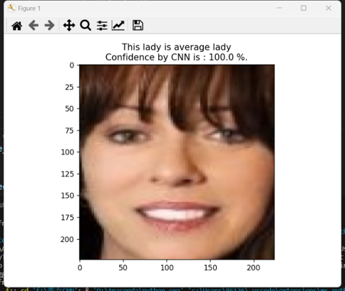

# Beauty_Average_Classifier
Build a CNN be trained to classify female facial images into one of two classes, Beautiful or Average. 

## Table of Contents
- [Introduction](#introduction)
- [Installation](#installation)
- [Architecture](#architecture)
- [Training](#training)
- [Evaluation](#evaluation)
- [Results](#results)
- [Contributing](#contributing)

## Installation

Include instructions on how to install any dependencies required for your project. For example:

```bash
pip3 install torch torchvision torchaudio --index-url https://download.pytorch.org/whl/cu121
pip install numpy
pip install matplotlib
pip install torchvision
pip install Pillow
```

## Architecture

Model Architecture:
1. Convolutional Layer 1
2. Pooling Layer 1
3. Convolutional Layer 2
4. Pooling Layer 2
5. Convolutional Layer 3
6. Pooling Layer 3
7. Fully Connected Layer 1
8. Fully Connected Layer 2
9. Fully Connected Layer 2
10. Output Layer

## Training
```bash
python train.py
```

## Evaluation
```bash
python Inference.py
```

## Results
Here are some results for this binary classifier:

  

## Contribution 
Link to data set:

[Data]([https://github.com/](https://www.kaggle.com/datasets/gpiosenka/beauty-detection-data-set)https://www.kaggle.com/datasets/gpiosenka/beauty-detection-data-set)

